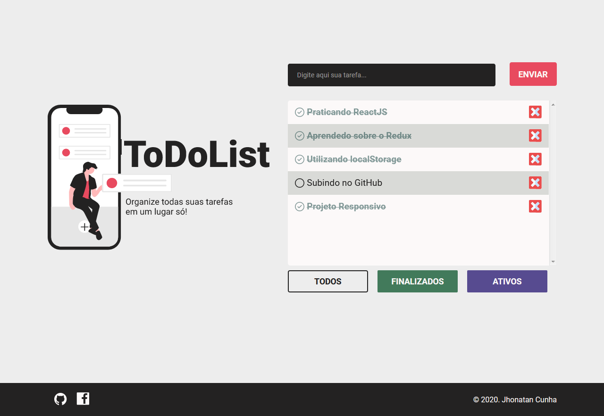
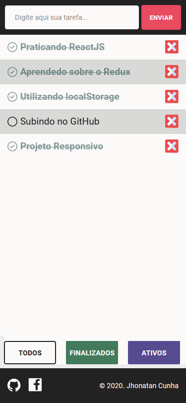
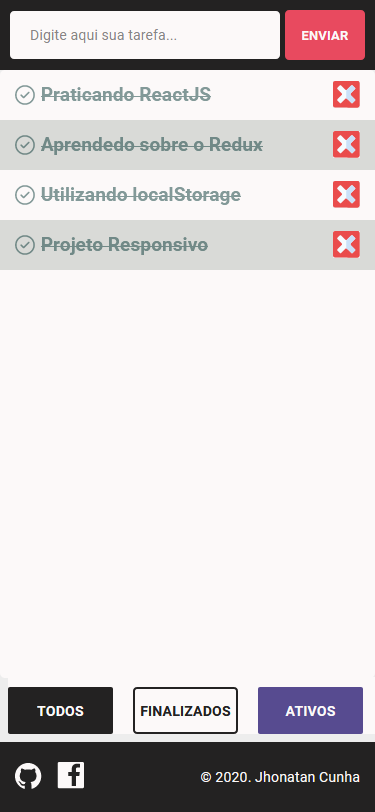
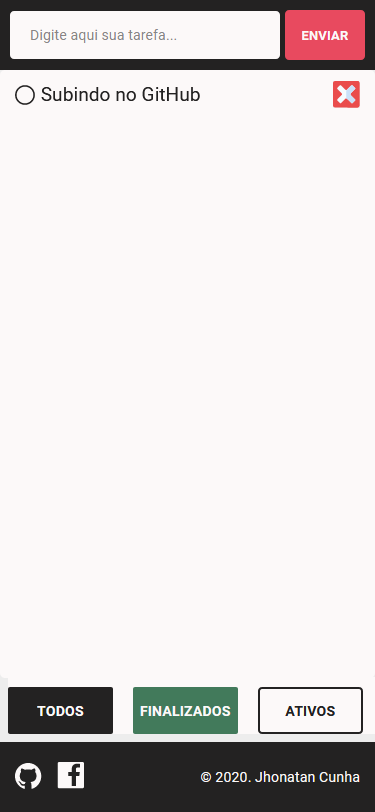

<h1 align="center">ToDoList System<h1>
<p align="center">


</p>

<br>


## :ballot_box_with_check: Demo Live
- [Netlify - Clique Aqui](https://todoclick.netlify.app/)

## :bookmark: Sobre


<p align="center">
    Aplição de ToDoList para você organizar todas as suas tarefas em um lugar só!
</p>

<br>

# :computer: Web View
<p align="center">
    
</p>

# :iphone: Mobile View

<table align="center">
    <tr>
        <td></td>
        <td></td>
        <td></td>
    </tr>
 </table>


## 🚀 Tecnologias

- [ReactJS](https://pt-br.reactjs.org/)
- [Redux](https://redux.js.org/)
- [Create React App](https://pt-br.reactjs.org/docs/create-a-new-react-app.html)
- [StoryBook](https://storybook.js.org/)
- [Styled-Components](https://styled-components.com/)

## ❓ Como utilizar?

### Instalação

```bash
$ cd to-do-list-reactjs
$ yarn
$ yarn start
```

# :ballot_box_with_check: Icons

- [Checked Icon](https://www.flaticon.com/free-icon/check-mark_1442912?term=checked&page=1&position=22)
- [Favicon](https://www.flaticon.com/free-icon/tasks_3039569?term=task&page=1&position=3)
- [Delete Icon](https://www.flaticon.com/free-icon/wrong_2673158?term=delete&page=1&position=94)
- [GitHub Icon](https://www.flaticon.com/free-icon/github_2111425?term=github&page=1&position=1)


<p align="center">
Made with :coffee: por :copyright: Jhonatan Cunha.
</p>
